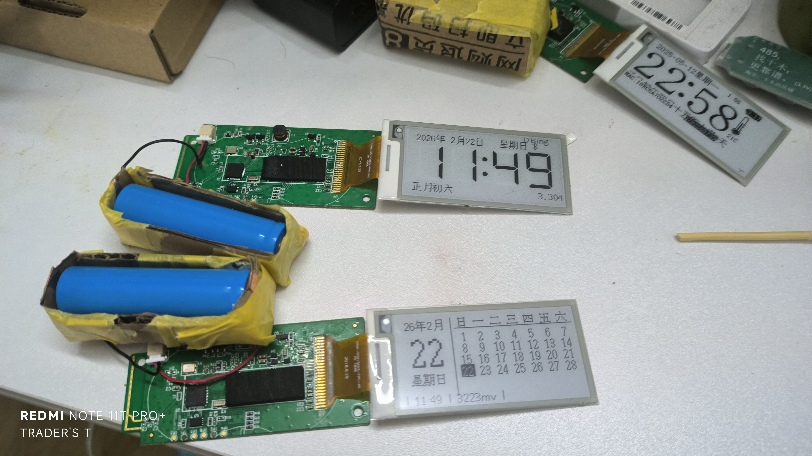

# 盒马时钟

基于HMCLOCK衍生的多种玩法

---


## 碎碎念
这是个人用于探索单片机的第一个尝试，所以项目内新增代码的AI率极高，且稳定性不行（日历仅支持一个分辨率，相比原仓库更容易出现花屏等）
如果在你那边出现了问题而我这边没有，我只能说~~它在我的机上能跑~~
当然有什么建议（或bug）欢迎提出

## 项目简介

本项目利用超市淘汰下来的 **盒马价签** 硬件，实现一个功能简单但实用的电子时钟，具有如下功能：

* ✅ 显示时间与日期
* ✅ 显示农历、节气与节假日
* ✅ 新增日历，自定义绘画等功能
* ✅ 显示电池电量
* ✅ 蓝牙对时
* ✅ 时间校准
* ✅ 蓝牙 OTA 更新

---

## 编译与烧写

请先下载 DA14585 的 [SDK](https://www.renesas.com/en/document/swo/sdk60221401-da1453x-da145856 "SDK") 包，目前使用 **6.0.22.1401** 版本。

1. 将本项目放置在：

   ```
   SDK_PATH/projects/target_apps/ble_examples
   ```

2. 使用Keil打开项目进行编译。

3. 编译完成后：

   * **调试模式运行一次**，固件会自动写入 Flash；
   * 或者使用 **SmartSnippets Toolbox** 将固件下载到 RAM 运行一次也可。

---

## 蓝牙对时

项目内置页面提供 **Web Bluetooth** 功能，可用于手动对时：

* 固件默认持续广播；
* 广播状态下，屏幕显示蓝牙图标与设备名后缀；
* 打开页面点击 “连接”，选中设备后，按 “同步时间” 即可完成同步。

## 时间校准

根据观察，默认状态下，时钟大概每天会快两秒左右。通过微调定时器的间隔，可以让时钟更精确。
在时间同步后，间隔两到三周，做两次校准，基本上就可以让时钟精准运行了。

* 设备链接后，按"时间校准"按钮，然后等待一分钟左右即可。
* 校准后请立即做一次时间同步。


首次上电会打开配对页面，打开网页就可以配对


网页端有**指令流水线**，按提示输入就能够按照顺序绘画
目前还不完善


---

## 外壳装配

外壳文件存储在3D目录文件下，采用推拉盖结构，推荐使用树脂打印。

---

## 关于盒马价签

本项目使用到的盒马价签屏幕类型如下：

|   尺寸   |  颜色  | 屏幕连接方式 |        型号        |      主控芯片      |  分辨率  | 拆解难度 | LED  |    测试点文件     |
| ------- | ------ | ----------- | ----------------- | ----------------- | ------- | -------- | ---- | --------------- |
| 2.13 寸 | 黑白   | 焊接         | HINK-E0213A41/A55 | IL3897 / SSD1675B | 212×104 | 困难     | 有   | pinout_1/0.xlsx |
| 2.13 寸 | 黑白   | 插座         | OPM021B1/         | IL3895 / SSD1673A | 250×122 | 困难     | 有   | pinout_0.xlsx   |
| 2.13 寸 | 黑白红 | 焊接         | HINK-E0213A67     | IL3897            | 250×122 | 困难     | 三色 | pinout_0.xlsx   |
| 2.9 寸  | 黑白红 | 插座         | HINK-E029A10      | IL3897            | 296×128 | 容易     | 有   | pinout_0.xlsx   |

>个人所用为HINK-E213A55，实测使用OPM021B1的配置能行
>再次注意，代码中写死了布局参数,如果要更改参数，请在**src/epd/epd.c**的user_app_init函数（约170行）下面的**epd_hw_init**函数把**122，250**换成别的,如果是红白屏，把后面的**EPD_BW**改成**EPD_BWR**

---

### Flash存储信息
###### 注意！
>由于观察到多次刷写flash会造成这些信息丢失，这些配置在这个项目中已经弃用（即不维护，处于“我不知道能不能用的状态”）
#### 屏幕引脚配置（地址 `0x39000`）

示例：

```
09 01 FF FF FF FF FF FF 21 22 10  01  20  07  11  23
                        CS ?? RST CLK SDI DC BUSY PWR
```

* 第一个字节 `09`：屏幕类型
* 第二个字节 `01`：引脚配置启用标志（非 `01` 表示无效）

#### 屏幕分辨率等信息（地址 `0x3a000`）

示例：

```
00 25 00 00 92 fa a8 fe 00 01 80 00 28 01 04 00
                          0080  0128          128x296  BWR
```

---

## 其他说明

* 原版价签固件存放在 Flash 的 SUOTA 区域；
* 大多数价签使用 OTP 启动器，但会从 Flash 继续加载固件；
* Flash 中包含屏幕和引脚配置，因此新固件无需硬编码这些信息；
* 原生固件无法被蓝牙扫描到，因此难以通过 OTA 更新；
* 价签多数电池电量不足，因此建议拆机替换供电。
* 该项目部分使用了**八丁饰尾体 16**[yzdnn/BaDingShiWeiTi-16: 基于KHドット八丁堀16衍生的中文像素字体 / A Chinese pixel font derived from KH Dot Hatcyoubori 16.](https://github.com/yzdnn/BaDingShiWeiTi-16)。如有侵权请告知，我会立刻删除
* 我正计划使用**袖珍像素体**[yzdnn/XiuZhenXiangSuTi: 基于k6x8衍生的中文像素字体 / A Chinese pixel font derived from k6x8.](https://github.com/yzdnn/XiuZhenXiangSuTi)进行字库移植，适配全GBK字库

---


