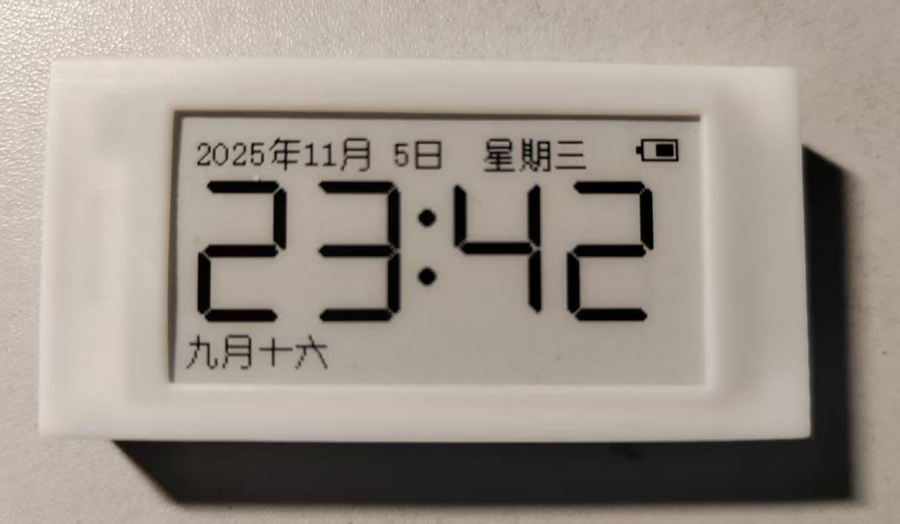
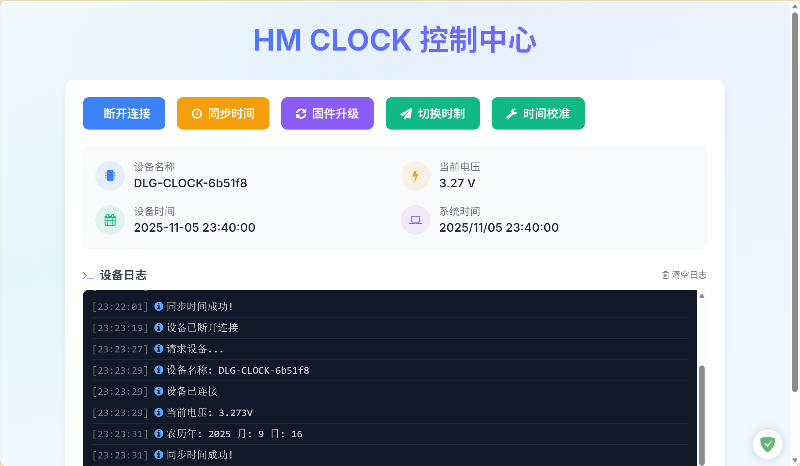
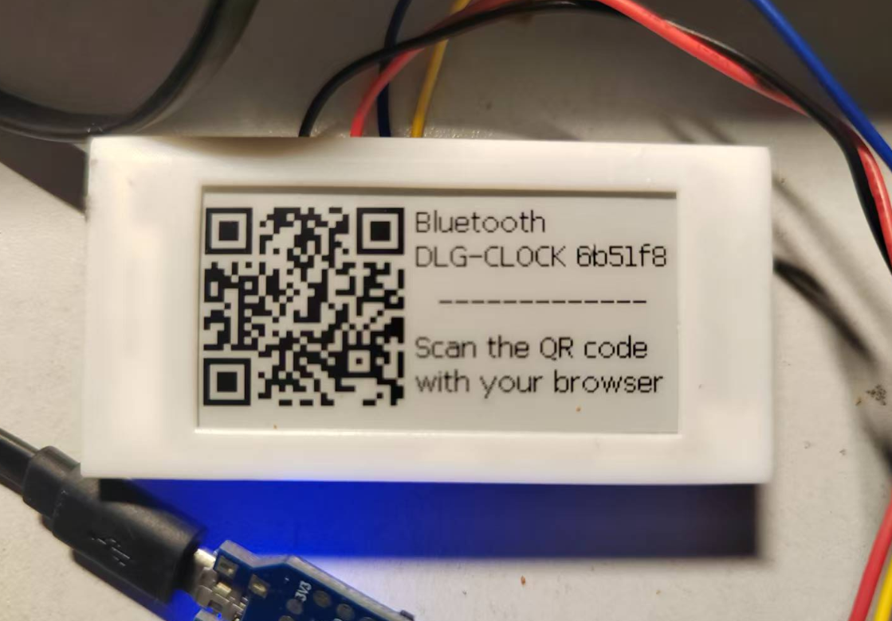

# 盒马时钟

---



## 项目简介

本项目利用超市淘汰下来的 **盒马价签** 硬件，实现一个功能简单但实用的电子时钟，具有如下功能：

* ✅ 显示时间与日期
* ✅ 显示农历、节气与节假日
* ✅ 显示电池电量
* ✅ 蓝牙对时
* ✅ 时间校准
* ✅ 蓝牙 OTA 更新

---

## 编译与烧写

请先下载 DA14585 的 [SDK](https://www.renesas.com/en/document/swo/sdk60221401-da1453x-da145856 "SDK") 包，目前使用 **6.0.22.1401** 版本。

1. 将本项目放置在：

   ```
   SDK_PATH/projects/target_apps/ble_examples
   ```

2. 使用Keil打开项目进行编译。

3. 编译完成后：

   * **调试模式运行一次**，固件会自动写入 Flash；
   * 或者使用 **SmartSnippets Toolbox** 将固件下载到 RAM 运行一次也可。

---

## 蓝牙对时

项目内置页面提供 **Web Bluetooth** 功能，可用于手动对时：

* 固件每隔 **整十分钟** 广播一次，持续 **30秒**；
* 广播状态下，屏幕显示蓝牙图标与设备名后缀；
* 打开页面点击 “连接”，选中设备后，按 “同步时间” 即可完成同步。

## 时间校准

根据观察，默认状态下，时钟大概每天会快两秒左右。通过微调定时器的间隔，可以让时钟更精确。
在时间同步后，间隔两到三周，做两次校准，基本上就可以让时钟精准运行了。

* 设备链接后，按"时间校准"按钮，然后等待一分钟左右即可。
* 校准后请立即做一次时间同步。



首次上电会打开配对页面，扫码跳转网页可以进行配对。



---

## 外壳装配

外壳文件存储在3D目录文件下，采用推拉盖结构，推荐使用树脂打印。

---

## 关于盒马价签

本项目使用到的盒马价签屏幕类型如下：

| 尺寸     | 颜色  | 屏幕连接方式 | 型号                | 主控芯片              | 分辨率     | 拆解难度 | LED | 测试点文件           |
| ------ | --- | ------ | ----------------- | ----------------- | ------- | ---- | --- | --------------- |
| 2.13 寸 | 黑白  | 焊接     | HINK-E0213A41/A55 | IL3897 / SSD1675B | 212×104 | 困难   | 有   | pinout_1/0.xlsx |
| 2.13 寸 | 黑白  | 插座     | OPM021B1          | IL3895 / SSD1673A | 250×122 | 困难   | 有   | pinout_0.xlsx   |
| 2.13 寸 | 黑白红 | 焊接     | HINK-E0213A67     | IL3897            | 250×122 | 困难   | 三色  | pinout_0.xlsx   |
| 2.9 寸  | 黑白红 | 插座     | HINK-E029A10      | IL3897            | 296×128 | 容易   | 有   | pinout_0.xlsx   |


---

### Flash存储信息

#### 屏幕引脚配置（地址 `0x39000`）

示例：

```
09 01 FF FF FF FF FF FF 21 22 10  01  20  07  11  23
                        CS ?? RST CLK SDI DC BUSY PWR
```

* 第一个字节 `09`：屏幕类型
* 第二个字节 `01`：引脚配置启用标志（非 `01` 表示无效）

#### 屏幕分辨率等信息（地址 `0x3a000`）

示例：

```
00 25 00 00 92 fa a8 fe 00 01 80 00 28 01 04 00
                          0080  0128          128x296  BWR
```

---

## 其他说明

* 原版价签固件存放在 Flash 的 SUOTA 区域；
* 大多数价签使用 OTP 启动器，但会从 Flash 继续加载固件；
* Flash 中包含屏幕和引脚配置，因此新固件无需硬编码这些信息；
* 原生固件无法被蓝牙扫描到，因此难以通过 OTA 更新；
* 价签多数电池电量不足，因此建议拆机替换供电。
